<div align="center">



<br/>

[](https://www.npmjs.com/package/api-in-browser)
[](LICENSE)
[](https://github.com/Tryboy869/browserclaw/actions)
[](https://www.typescriptlang.org/)
[](https://react.dev/)
[](https://vitejs.dev/)
[](#)
[](#)
[](https://huggingface.co/)

<br/>

> **The browser is the most distributed computer on Earth. Let's use it.**
>
> *BrowserWasp* is a complete AI agent platform running entirely in a browser tab.  
> No server. No backend. No installation. Just open a URL.

<br/>

[📦 Install](#-quick-start) • [🏗️ Architecture](#-architecture) • [🤖 Models](#-model-management) • [🔌 Integrations](#-integrations) • [📖 Docs](#-documentation)

</div>

---

## 🎯 What Is BrowserWasp?

BrowserWasp transforms your browser tab into a **fully operational AI agent**. It combines:

- A **local LLM runtime** — models run on your machine via ONNX Runtime Web
- A **cloud AI router** that intelligently falls back to Groq, Kimi K2, OpenAI, or 6 other providers
- A **gravitational memory system** (RAG Booster) giving your agent unlimited context
- **Web Workers** for parallel compute without freezing your UI
- **Physical world access** via Web Bluetooth, USB, NFC, webcam, and microphone
- A **Telegram bot** and built-in WebChat, all from one browser tab

---

## ✨ Features

### 🧠 Intelligent AI Routing

| Signal | Score | Detection |
|--------|-------|-----------|
| Token count > 1000 | +2 | Automatic |
| Token count > 4000 | +4 | Cumulative |
| Multi-step task | +3 | Keywords + numbered steps |
| Domain-specific (code/math/law) | +2 | Keyword regex |
| Privacy keyword | Force LOCAL | "private", "confidential" |
| Real-time required | Force LOCAL | "now", "immediately" |

Score ≥ 6 → CLOUD. Score < 6 + local model loaded → LOCAL.

### 💾 Gravitational Memory

- Documents chunked → SHA-256 hashed → encoded in Gravitational Bits
- 100% integrity verification on every retrieval
- Stored in IndexedDB — 60GB+ capacity, survives browser restarts
- Top-K semantic retrieval injected as context before every LLM call

### 🤖 Local AI Models

| Model | Size | VRAM | Best For |
|-------|------|------|----------|
| Qwen/Qwen2.5-0.5B-Instruct | ~400MB | 1GB | Fast replies |
| Qwen/Qwen2.5-1.5B-Instruct | ~1GB | 2GB | General chat |
| Qwen/Qwen2.5-3B-Instruct | ~2GB | 4GB | Reasoning, code |
| microsoft/phi-2 | ~1.5GB | 3GB | Math, logic |
| TinyLlama/TinyLlama-1.1B-Chat | ~600MB | 1.5GB | Ultra-fast |
| openai/whisper-tiny | ~150MB | — | Speech-to-text |
| openai/whisper-small | ~460MB | — | High-accuracy STT |

### ☁️ Cloud Providers

| Provider | Model fetch | Notes |
|----------|------------|-------|
| Groq | ✅ Live | Ultra-fast, generous free tier |
| Moonshot (Kimi K2) | ✅ Live | 128K context, outstanding reasoning |
| OpenAI | ✅ Live | GPT-4o, o1, o3 |
| Anthropic | ✅ Live | Claude 3.7, 200K context |
| Mistral | ✅ Live | European, GDPR-friendly |
| Google Gemini | ✅ Live | Multimodal, 1M context |
| Together AI | ✅ Live | Open-source models cloud |
| Cohere | ✅ Live | Command R+, excellent RAG |
| HuggingFace Inference | Manual ID | Any HF model via API |

### 🌍 Physical World Integration

| Browser API | Agent Capability |
|-------------|-----------------|
| Web Bluetooth | Read health sensors, control smart home devices |
| WebUSB | Arduino, printers, custom hardware |
| Web Serial | Microcontrollers, lab instruments |
| Web NFC (Android) | Read/write NFC tags — inventory, access control |
| Camera | Vision — object detection, QR codes, document reading |
| Microphone | Voice input → Whisper transcription → agent |
| Screen Capture | Contextual assistance — agent observes your screen |
| Geolocation | Location-aware responses, geo-triggered actions |
| Notifications | Proactive alerts even when tab is backgrounded |

### 🔌 Integrations

| Category | Services |
|----------|---------|
| Channels | Telegram Bot, Discord Bot, WebChat, Webhooks |
| Dev Tools | GitHub (code, issues, PRs, commits) |
| Productivity | Notion, Google Calendar, Gmail/SMTP |
| Team | Slack, Linear |
| Data | Airtable |
| Communication | Twilio (SMS/Voice) |
| Audio | ElevenLabs TTS, OpenAI TTS, Deepgram |
| Search | Serper, Brave Search, NewsAPI |

---

## 🏗️ Architecture

```
┌─────────────────────────────────────────────────────────┐
│                    BROWSER TAB                          │
│                                                         │
│  ┌──────────────┐    ┌──────────────────────────────┐  │
│  │  Main Thread  │    │      Web Workers             │  │
│  │   (UI/React)  │◄──►│  W1: Task Router (routing)  │  │
│  │               │    │  W2: Inference (ONNX local)  │  │
│  └──────────────┘    └──────────────────────────────┘  │
│         │                        │                       │
│         ▼                        ▼                       │
│  ┌──────────────┐    ┌──────────────────────────────┐  │
│  │  api-in-     │    │      RAG Booster             │  │
│  │  browser     │    │  Gravitational Memory        │  │
│  │  (Gateway)   │    │  IndexedDB 60GB+             │  │
│  └──────────────┘    └──────────────────────────────┘  │
│                                  │                       │
│  ┌───────────────────────────────▼──────────────────┐  │
│  │   Physical World: Bluetooth · USB · NFC · Camera  │  │
│  └───────────────────────────────────────────────────┘  │
└─────────────────────────────────────────────────────────┘
         │                         │
   Telegram / Discord         Cloud LLM APIs
```

### File Structure

```
browserclaw/
├── src/
│   ├── core/           config.js · gateway.js · soul.js
│   ├── workers/        task-router.js · inference.js
│   ├── memory/         rag-booster.js · gravitational-bit.js
│   ├── channels/       telegram.js · webchat.js
│   ├── models/         model-manager.js · model-registry.js
│   ├── integrations/   providers.js · api-registry.js
│   └── ui/pages/       Dashboard · Chat · Models · Integrations · Config · Logs
├── assets/             header.svg · logo.svg · contributor-anzize.svg · footer.svg
├── index.html
├── package.json
└── vite.config.ts
```

---

## 🚀 Quick Start

```bash
git clone https://github.com/Tryboy869/browserclaw.git
cd browserclaw
npm install
npm run dev
```

Open `http://localhost:5173` — the onboarding wizard guides setup in under 2 minutes.

**4-step onboarding:**
1. Choose your language (12 supported)
2. Name your agent and set personality (Soul)
3. Configure AI — local model download or cloud API key
4. Connect Telegram *(optional)*

---

## 🔐 Security

- API keys encrypted with **AES-GCM** via WebCrypto (optional passphrase)
- Keys never logged — injected into headers at call time only
- **Privacy Mode** — forces 100% local processing
- **Wipe all data** — one button, full IndexedDB deletion
- Zero telemetry, zero tracking

---

## 👤 Author

<div align="center">



<br/><br/>

[](mailto:anzize.contact@proton.me)
[](https://tryboy869.github.io/daa)
[](https://twitter.com/Nexusstudio100)
[](https://linkedin.com/in/anzize)

🎯 **Q1 2026 Open To:** Research engineering · AI infrastructure · Protocol design · Remote

</div>

---

## 📄 License

MIT © 2026 Daouda Abdoul Anzize

<div align="center">

</div>
